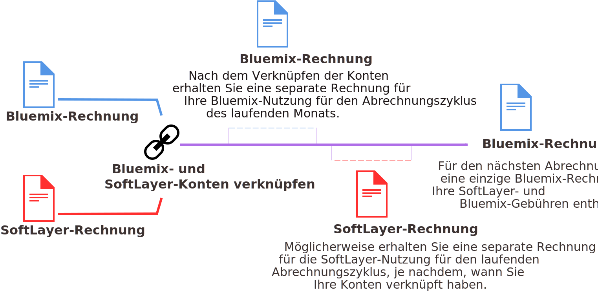

---

copyright:

  years: 2015, 2017
lastupdated: "2017-05-31"

---

{:shortdesc: .shortdesc}
{:codeblock: .codeblock}
{:screen: .screen}
{:new_window: target="_blank"}

# Ihre Bluemix- und SoftLayer-Konten verknüpfen
{: #unifyingaccounts}

Sie können Ihr {{site.data.keyword.Bluemix_notm}}- und Ihr SoftLayer-Konto verknüpfen, um die Ressourcen beider Konten zu nutzen. Wenn Sie Ihr {{site.data.keyword.Bluemix_notm}}- und Ihr Softlayer-Konto miteinander verknüpfen, erhalten Sie nur eine {{site.data.keyword.Bluemix_notm}}-Abrechnung. Wenn Sie über ein bestehendes {{site.data.keyword.Bluemix_notm}}-Konto verfügen, erfolgt die Rechnungsstellung für SoftLayer-Ressourcen über {{site.data.keyword.Bluemix_notm}} ab dem neuen Abrechnungszyklus, der nach dem Verknüpfen der Konten beginnt.

**Wichtig:** Alle verknüpften Konten in {{site.data.keyword.Bluemix_notm}} müssen nutzungsabhängige Konten sein. Sie können ein nutzungsabhängiges Konto erstellen, ein bestehendes nutzungsabhängiges Konto oder ein bestehendes Testkonto (das dann auf ein nutzungsabhängiges Konto aktualisiert wird) verknüpfen. {{site.data.keyword.Bluemix_notm}}-Abonnementkonten können nicht verknüpft werden.

Sie müssen ein Masterbenutzer des SoftLayer-Kontos sein, um Konten verknüpfen zu können.

Nach dem Verknüpfen Ihrer Konten gilt Folgendes:

* Für den Zugriff sowohl auf das SoftLayer- als auch auf das {{site.data.keyword.Bluemix_notm}}-Konto müssen Sie Ihre IBMid-Berechtigungsnachweise verwenden.
* Alle bestehenden SoftLayer-Rabatte werden auf alle {{site.data.keyword.Bluemix_notm}}-Gebühren angewandt.
* Sie erhalten nur eine Rechnung; diese ist in USD ausgestellt.
* Sie können die Nutzung der {{site.data.keyword.BluSoftlayer}}-Ressourcen in der {{site.data.keyword.Bluemix_notm}}-Konsole überwachen.

**Achtung:** Das Verknüpfen der Konten kann nicht rückgängig gemacht werden.  

Führen Sie als Masterbenutzer die folgenden Schritte aus, um die {{site.data.keyword.Bluemix_notm}}- und SoftLayer-Konten zu verknüpfen:

 1. Klicken Sie im {{site.data.keyword.slportal}} auf **{{site.data.keyword.Bluemix_notm}}-Konto verknüpfen**.
 2. Lesen und akzeptieren Sie die Bedingungen für das Verknüpfen von SoftLayer- und {{site.data.keyword.Bluemix_notm}}-Konten.
 3. Geben Sie nach entsprechender Aufforderung die E-Mail-Adresse an, die Ihrem {{site.data.keyword.Bluemix_notm}}-Konto zugeordnet ist. Wenn Sie über kein {{site.data.keyword.Bluemix_notm}}-Konto verfügen, geben Sie die von Ihnen gewünschte E-Mail-Adresse an und befolgen Sie die Anweisungen für die Einladung zu {{site.data.keyword.Bluemix_notm}} und das Erstellen eines Kontos.

Nach dem Verknüpfen der Konten ist die Option **Zu {{site.data.keyword.Bluemix_notm}} wechseln** in der Menüleiste der SoftLayer-Konsole verfügbar. Wenn Sie auf diesen Link klicken, wird die {{site.data.keyword.Bluemix_notm}}-Anmeldeseite geöffnet.

## Rechnungsstellung für {{site.data.keyword.Bluemix_notm}}-Nutzung bei verknüpften Konten
{: #bill_usage}

Nach der Verknüpfung Ihrer {{site.data.keyword.Bluemix_notm}}- und SoftLayer-Abrechnungskonten erfolgt die Rechnungsstellung im nächsten Abrechnungszyklus über eine einzige {{site.data.keyword.Bluemix_notm}}-Rechnung.
{:shortdesc}

Der {{site.data.keyword.Bluemix_notm}}-Nutzungszyklus basiert auf Kalendermonaten, sodass Ihr Konto monatlich an dem Abrechnungstag abgerechnet wird, der in der Gebührenvereinbarung festgelegt wurde. Bei SoftLayer beginnt der Nutzungszyklus mit dem Beginn der SoftLayer-Nutzung, sodass die Rechnungsstellung jeden Monat an dem Tag erfolgt, an dem Sie sich für Ihr SoftLayer-Konto angemeldet haben. 

Wenn Sie Ihre Konten verknüpfen, wird die {{site.data.keyword.Bluemix_notm}}-Nutzung für den aktuellen Monat noch wie bisher abgerechnet und Sie erhalten für diesen Nutzungszeitraum eine {{site.data.keyword.Bluemix_notm}}-Rechnung. Ab dem Ersten des Folgemonats werden Ihre {{site.data.keyword.Bluemix_notm}}- und SoftLayer-Gebühren zusammen über Ihre {{site.data.keyword.Bluemix_notm}}-Rechnung abgerechnet.

Wenn Sie Ihre Konten beispielsweise am 16. April 2017 verknüpft haben, erhalten Sie für die Nutzung im April eine Bluemix-Rechnung. Je nach Zeitpunkt der Verknüpfung Ihrer Konten erhalten Sie möglicherweise eine separate Rechnung für Ihre SoftLayer-Nutzung. Die Nutzung im Mai sowohl für SoftLayer als auch für {{site.data.keyword.Bluemix_notm}} wird über Ihr {{site.data.keyword.Bluemix_notm}}-Konto abgerechnet.

Nach der Verknüpfung Ihrer Rechnungen werden in Ihrer {{site.data.keyword.Bluemix_notm}}-Rechnung die verschiedenen Gebühren für jede Ressource aufgelistet, die Sie verwendet haben.

## API-basierte Bluemix-Services
{: #api_based_bluemix_services}

Die folgende Liste enthält die Services, die zur Ausführung mit dem Anwendungscode eingerichtet werden können.
{:shortdesc}

Nicht alle Pläne für diese Services stehen für die Verwendung mit verknüpften {{site.data.keyword.Bluemix_notm}}- und SoftLayer-Konten zur Verfügung. Für verknüpfte Konten können nur die für nutzungsabhängige Konten aktivierten Pläne verwendet werden. Wenn Sie jedoch über ein separates {{site.data.keyword.Bluemix_notm}}-Konto mit separater Rechnungsstellung verfügen, können Sie beliebige Pläne für diese Services verwenden.

* {{site.data.keyword.alchemyapishort}}
* {{site.data.keyword.alertnotificationshort}}
* {{site.data.keyword.sparks}}
* {{site.data.keyword.appseccloudshort}}
* {{site.data.keyword.blockchain}}
* {{site.data.keyword.cloudant}}
* {{site.data.keyword.conceptinsightsshort}}
* {{site.data.keyword.iotmapinsights_short}}
* {{site.data.keyword.dashdbshort}}
* {{site.data.keyword.dialogshort}}
* {{site.data.keyword.documentconversionshort}}
* {{site.data.keyword.twittershort}}
* {{site.data.keyword.weather_short}}
* {{site.data.keyword.iotdriverinsights_short}}
* {{site.data.keyword.geospatialshort_Geospatial}}
* {{site.data.keyword.graphshort}}
* {{site.data.keyword.iotelectronics}}
* {{site.data.keyword.languagetranslationshort}}
* {{site.data.keyword.messagehub}}
* {{site.data.keyword.mqa}}
* {{site.data.keyword.mobileappbuilder_short}}
* {{site.data.keyword.mql}}
* {{site.data.keyword.nlclassifiershort}}
* {{site.data.keyword.objectstorageshort}}
* {{site.data.keyword.personalityinsightsshort}}
* {{site.data.keyword.presenceinsightsshort}}
* {{site.data.keyword.relationshipextractionshort}}
* {{site.data.keyword.retrieveandrankshort}}
* {{site.data.keyword.servicediscoveryshort}}
* {{site.data.keyword.speechtotextshort}}
* {{site.data.keyword.sqldb}}
* {{site.data.keyword.streaminganalyticsshort}}
* {{site.data.keyword.texttospeechshort}}
* {{site.data.keyword.toneanalyzershort}}
* {{site.data.keyword.tradeoffanalyticsshort}}
* {{site.data.keyword.visualinsightsshort}}
* {{site.data.keyword.visualrecognitionshort}}
* {{site.data.keyword.workflow}}
* {{site.data.keyword.workloadscheduler}}
